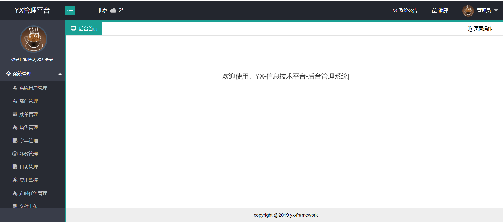
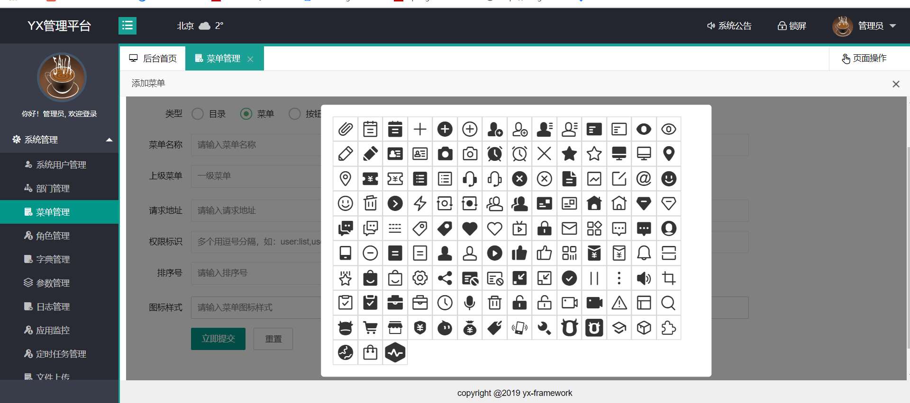
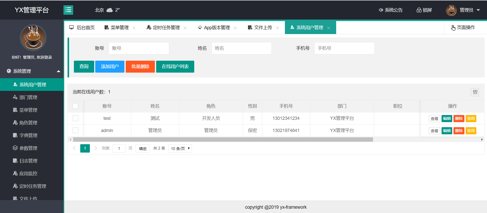
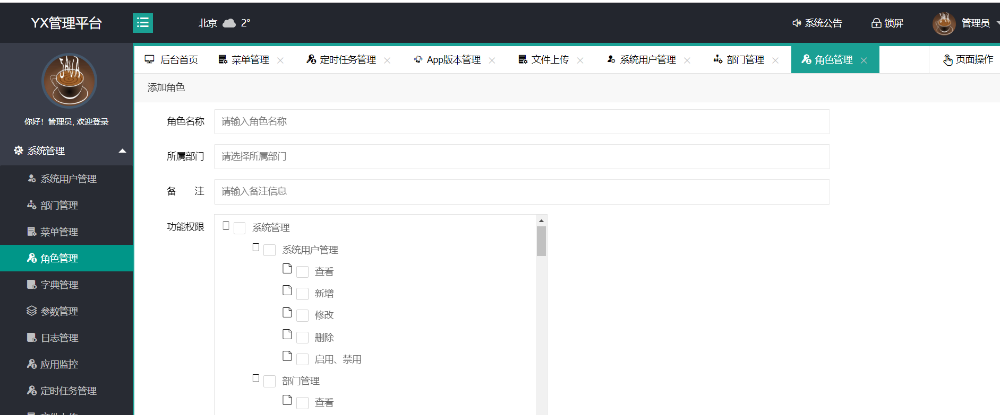
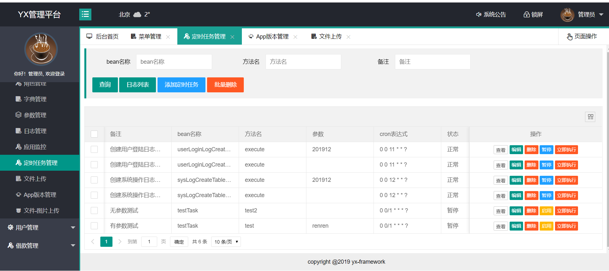
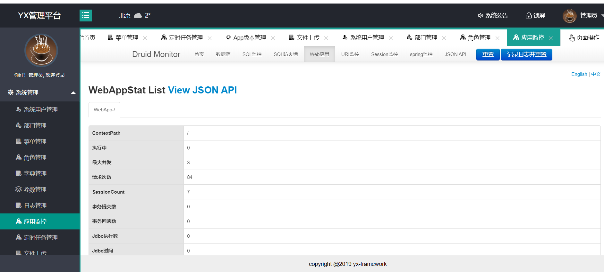
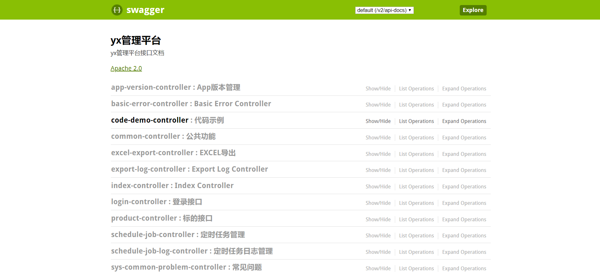
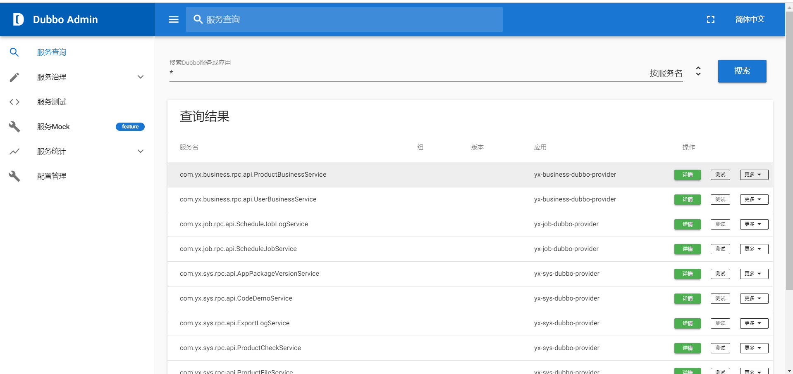
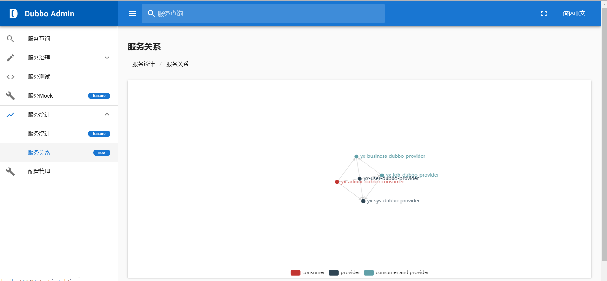

## yx-framework
yx信息技术平台

总体架构说明：

yx-framework ............................................ yx信息架构
     
     yx-common .......................................... 公共基础模板
     
     yx-generator ....................................... 代码生成器
     
     yx-job ....................................... 定时任务模块
     
     yx-business .................................. 业务组装模块（用于处理具体业务逻辑，注：【该模块既是服务调用方也是服务提供方】）
     
    
     
     yx-service ....................................... 微服务模块
         yx-sys .............................................. 系统基础服务模块（服务提供方）
            yx-sys-common ...................................... 枚举、常量
            yx-sys-model ....................................... 实体类
            yx-sys-dao ......................................... Mapper接口文件
            yx-sys-rpc-api ..................................... 接口定义
            yx-sys-rpc-service ................................. 具体实现
        
    
         yx-user ........................................ ...客户模块（服务提供方）
            yx-user-common ................................. 
            yx-user-model .................................. 
            yx-user-dao .................................... 
            yx-user-rpc-api ................................ 
            yx-user-rpc-service ............................ 
            
         
           >>>>>>>>>>>>>>>>>>>>>>>>>>>>>根据实际业务需要，模块会不断增加<<<<<<<<<<<<<<<<<<<<<<<<<<<  
        
        
     yx-server .......................................服务调用模块  
         yx-admin-server .................................... 系统管理系统（服务调用方）
         yx-web-server ...................................... web网站（服务调用方）
         yx-wx-server ....................................... 微信（服务调用方）
         yx-mobile-server ................................... APP（服务调用方）
         yx-api-server ...................................... 第三方API（服务调用方）
         
         
     
     yx-ui ................................................系统静态页面
         yx-ui-admin..........................................后台管理系统页面
     
    
    
    
     项目开发依赖的环境
         1、安装maven,lombok(开发工具的不同，安装方式不同)
    
     项目运行依赖的环境：
         1、安装mysql,zookeeper,redis,nginx并启动相关服务
         2、先启动服务的提供方，运行每个模块下rpc-service中的serviceApplication的main方法，即可启动相关服务
         3、启动服务调用方，运行每个-server工程下的serverApplication的main方法，即可启动相关服务
         
         
     ## 项目简介
     - yx-framework是Java语言的分布式系统架构。 使用SpringBoot整合开源框架。
     - 作者根据自己的工作经历将架子抽离出来，方便二次开发，大家可以根据自己的业务去扩展架构；
     
     - 公共功能：公共功能(基类、数据访问组件、读写分离、分布式session、HTTP客户端、日志服务、队列服务、支付服务组件、redis缓存、Web安全等等)、公共配置、工具类。
     - 系统管理：包括用户管理、部门管理、菜单管理、角色管理、字典管理、参数管理、日志管理、应用监控等等。
     - 业务相关：微信/支付宝支付。
     - 系统通信：支持扩展子系统，子系统之间使用Dubbo或MQ进行通信。
     - 演示平台使用Maven对项目进行模块化管理，提高项目的易开发性、扩展性。
     
     ## 主要功能
      1. 数据库：Druid数据库连接池，监控数据库访问性能，统计SQL的执行性能。 
      2. 持久层：mybatis持久化，使用MyBatis-Plus优化，减少sql开发量；aop切换数据库实现读写分离。Transtraction注解事务。
      3. MVC： 基于spring mvc注解,Rest风格Controller。Exception统一管理。
      4. 缓存和Session：注解redis缓存数据，Spring-session和redis实现分布式session同步，重启服务会话不丢失。
      5. 数据同步：基于redis的分布式锁。
      6. Web安全：实现XSS过滤和CSR过滤。
      7. 多系统交互：Dubbo,ActiveMQ多系统交互。
      8. 前后端分离：前端使用ajax访问后端的rest服务，后端返回json格式数据。页面用nginx反向代理访问。
      9. 支付功能：实现微信和支付宝支付客户端。
      10. 日志：Logback打印日志，默认打印Web和Service简要日志。
      11. 工具类：字符串处理，类型转换，日期处理，IO和文件，Excel读写，加密解密，HTTP客户端，XML处理，转码，各种Util等等。
      12. 代码生成器：根据数据库表结构生成简单的增删改查功能代码，包括model、mapper、service、controller。
     
     ## 技术选型
         ● 核心框架：Spring Boot 1.5.12.RELEASE + Dubbo 2.5.7
         ● 分布式协调服务：ZooKeeper 3.4.11
         ● 校验框架：Hibernate Validator 5.3.5.Final
         ● 安全框架：Apache Shiro 1.4.0
         ● 代码生成：MyBatis Plus Generator 2.1.6
         ● 持久层框架：MyBatis 3.4.5 + MyBatis-Plus 2.1.6
         ● 数据库连接池：Alibaba Druid 1.1.9
         ● 缓存框架：Redis.clients:jedis 2.8.2
         ● 队列框架：Apache ActiveMQ 5.14.5
         ● 会话管理：Spring-Session 1.3.1
         ● 日志管理：SLF4J 
         ● 前端框架：Layui 2.2.45
         ● 公用工具集：Hutool 3.2.3
         ● 支付组件：Egan pay-java-parent 2.0.7
         ● 代码简化：Lombok 1.16.20
         ● 序列化框架：Alibaba Fastjson 1.2.41
         ● HTTP客户端：Hutool-http 4.0.10
         ● 接口测试框架：Swagger2
         ● 字体图标：Alibaba Iconfont
         ● JWT：jsonwebtoken 0.9.0
         
     ## 本地部署
     
       1. 环境要求
        * JDK1.8+
        * MySQL5.5+
        * Maven3.3+
        * Zookeeper3.3+
        * Redis3.0+
        * Nginx1.8+
        * Apache Activemq-5.0+ (可选)
      2.	执行SQL文件doc/sqls/yxdb.sql，初始化库、表和数据；
      3.	修改每个工程/src/main/resources/application-dev.yml，更新MySQL帐号密码，Redis的IP、端口和密码,Zookeeper的地址；
      5.	修改Nginx/conf/nginx.conf，指定静态和动态页面地址（参考附件）；
      6.	启动MySQL, Zookeeper, Redis, Nginx;
      7. IntelliJ IDEA 菜单File-Settings-Plugins，添加lombok plugin插件
      8. 访问地址：http://localhost 帐户密码：admin/123456
      9. swagger地址：http://localhost:8089/swagger-ui.html
     10. 文件上传、邮件推送，邮件发送，短信发送等工具类可能不可用，需要将自己申请的accessKeyId，accessKeySecret配置到参数表中（sys_param）方可正常使用
   
     ## 项目地址
             ● gitee： https://gitee.com/thl9090/yx-framework1
             ● github：https://github.com/thl9090/yx-framework1
     
     ## 项目演示
        ● 演示地址： http://134.175.157.186/
        ● 账号、密码：test/123456
     
     
     说明：演示环境会慢慢完善、sql文件将在最近几天提交，请大家多多关注，帮忙点下star
     QQ群：977482984
     ##扫码入群   
      
        
         
     ## 预览图
     
   
   
   
   
   
   
   
   
   
   
     
         
     ## 版权声明
     yx-framework使用 [Apache License 2.0][] 协议.
     
     [Apache License 2.0]: http://www.apache.org/licenses/LICENSE-2.0
     
